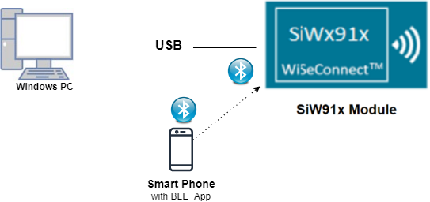
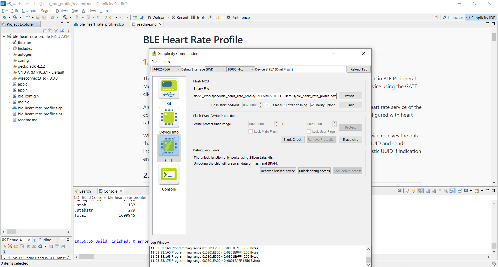
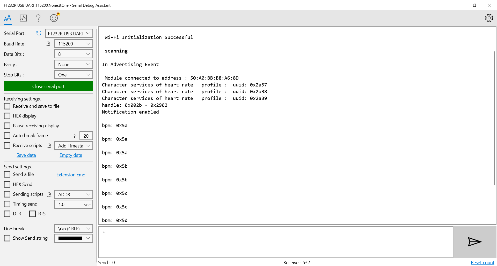

# BLE Heart Rate Profile

## 1. Purpose / Scope

This application demonstrates how to configure SiWx91x module as a GATT server with Heart Rate Service in BLE Peripheral Mode and explains how to do indicate operations with the GATT server from a connected remote device using the GATT client.

Also configure SiWx91x module as a GATT client in BLE central mode and enable indication of operation of the heart rate service of the connected remote GATT server from the GATT client. In the application,Heart rate GATT server is configured with heart rate service and their corresponding characteristic UUIDs.

When the connected remote device writes data to writable characteristic UUID, the WiseConnect device receives the data that is received on writable characteristic UUID and writes the same data to readable characteristic UUID and sends indications to the connected device (or) remote device can read the same data using read characteristic UUID if indication enabled on client side.

## 2. Prerequisites / Setup Requirements

Before running the application, the user will need the following things to setup.

### 2.1 Hardware Requirements

- Windows PC with Host interface(UART/ SPI/ SDIO).
   - SiWx91x Wi-Fi Evaluation Kit. The SiWx91x supports multiple operating modes. See [Operating Modes]() for details.
  - **SoC Mode**: 
      - Silicon Labs [BRD4325A, BRD4325B](https://www.silabs.com/)
  - **NCP Mode**:
      - Silicon Labs [(BRD4180A, BRD4280B)](https://www.silabs.com/);
      - Host MCU Eval Kit. This example has been tested with:
        - Silicon Labs [WSTK + EFR32MG21](https://www.silabs.com/development-tools/wireless/efr32xg21-bluetooth-starter-kit) 
- BLE Smart Phone with GATT client

### 2.2 Software Requirements
   
- Embedded Development Environment
   - For Silicon Labs EFx32, use the latest version of [Simplicity Studio](https://www.silabs.com/developers/simplicity-studio)
   
- Download and install the Silicon Labs [EFR Connect App](https://www.silabs.com/developers/efr-connect-mobile-app) in the android smart phones for testing BLE applications. Users can also use their choice of BLE apps available in Android/iOS smart phones.

### 2.3 Setup Diagram:
**SoC Mode :**

   
 
**NCP Mode :** 


## 3. Project Environment

1. Ensure the SiWx91x loaded with the latest firmware following the [Getting started with a PC](https://docs.silabs.com/rs9116/latest/wiseconnect-getting-started)

### 3.1 Creating the Project

#### 3.1.1 SoC Mode

1. Ensure the SiWx91x setup is connected to your PC.

- In the Simplicity Studio IDE, the SiWx91x SoC board will be detected under **Debug Adapters** pane as shown below.

   
   
- Studio should detect your board. Your board will be shown here. Click on the board detected and go to **EXAMPLE PROJECTS & DEMOS** section.  

- Filter for Bluetooth examples from the Gecko SDK added. For this, check the *Bluetooth* checkbox under **Wireless Technology** and select *BLE - Heart Rate* application.

   

- Click 'Create'. The "New Project Wizard" window appears. Click 'Finish'

  

#### 3.1.2 NCP mode

1. Ensure the EFx32 and SiWx91x setup is connected to your PC.

- In the Simplicity Studio IDE, the EFR32 board will be detected under **Debug Adapters** pane as shown below.
   
   

- Ensure the latest Gecko SDK along with the WiSeConnect 3 extension is added to Simplicity Studio.

- Go to the 'EXAMPLE PROJECT & DEMOS' tab and select *BLE - Heart Rate* application.

- Click 'Create'. The "New Project Wizard" window appears. Click 'Finish'.

  
  

### 3.2 Setup for Application Prints

#### 3.2.1 SoC Mode

  You can use either of the below USB to UART converters for application prints.

1. Set up using USB to UART converter board.

   - Connect Tx (Pin-6) to P27 on WSTK
   - Connect GND (Pin 8 or 10) to GND on WSTK

   ****

2. Setup using USB to UART converter cable.

   - Connect RX (Pin 5) of TTL convertor to P27 on WSTK
   - Connect GND (Pin1) of TTL convertor to GND on WSTK
    
   ****


**Tera Term setup - for NCP and SoC modes**

1. Open the Tera Term tool.

	- For SoC mode, choose the serial port to which USB to UART converter is connected and click on **OK**. 

   ****

	- For NCP mode, choose the J-Link port and click on **OK**.
    
   ****

2. Navigate to the Setup → Serial port and update the baud rate to **115200** and click on **OK**.

  ****
 
  ****


## 4 Application Build Environment

The application can be configured to suit your requirements and development environment. Read through the following sections and make any changes needed.

### 4.1 Configure the Application

Open `app.c` file and update/modify following macros,

User must update the below parameters

- **GATT\_ROLE** refers the role of the Silicon Labs module to be selected.

   - If user configures, **SERVER**, Silicon Labs module will act as GATT SERVER, means will add heart rate profile.

   - If user configures, **CLIENT**, Silicon Labs module will act as GATT CLIENT, means will connect to remote GATT server and get services and enable notify.
   
```c
	 #define GATT_ROLE                                     SERVER```
- `RSI_BLE_DEV_ADDR_TYPE` refers address type of the remote device to connect.
  - Based on the address of the advertising device, Valid configurations are

    - LE_RANDOM_ADDRESS
    - LE_PUBLIC_ADDRESS
    
    **Note:** Depends 
    - LE_PUBLIC_ADDRESS
```c
	 #define RSI_BLE_DEV_ADDR_TYPE                         LE_PUBLIC_ADDRESS
``` 
   **Note:** Depends on the remote device, address type will be changed. 
   
-   `RSI_BLE_DEV_ADDR` refers address of the remote device to connect.
```c
	 #define RSI_BLE_DEV_ADDR                              "00:23:A7:80:70:B9"
```

-  `RSI_REMOTE_DEVICE_NAME` refers the name of remote device to which Silicon Labs device has to connect.
```c
	 #define RSI_REMOTE_DEVICE_NAME                        "SILABS_DEV"
```	
**Note:**
   Silicon Labs module can connect to remote device by referring either RSI_BLE_DEV_ADDR or RSI_REMOTE_DEVICE_NAME of the remote device.

   **Power save configuration**

-  By default, The Application is configured without power save.
```c	 
	 #define ENABLE_POWER_SAVE 0```
-  If user wants to run the application in power save, modify the below configuration. 
```c	 
	 #define ENABLE_POWER_SAVE 1 
```

The desired parameters are provided below. User can also modify the parameters as per their needs and requirements
   
- `RSI_BLE_HEART_RATE_UUID` refers to the attribute value of the newly created service.
```c
	 #define RSI_BLE_HEART_RATE_SERVICE_UUID                0x180D```
- `RSI_BLE_HEART_RATE_MEASUREMENT_UUID` refers to the attribute type of the first attribute under this service (RSI_BLE_HEART_RATE_SERVICE_UUID`).
```c
	 #define RSI_BLE_HEART_RATE_MEASUREMENT_UUID            0x2A37```
- `RSI_BLE_SENSOR_LOCATION_UUID` refers to the attribute type of the second attribute under this service (RSI_BLE_HEART_RATE_SERVICE_UUID`).
```c
	 #define RSI_BLE_SENSOR_LOCATION_UUID                   0x2A38```
- `RSI_BLE_HEART_RATE_CONTROL_POINT_UUID` refers to the attribute type of the second attribute under this service (`RSI_BLE_HEART_RATE_SERVICE_UUID`).
```c
	 #define RSI_BLE_HEART_RATE_CONTROL_POINT_UUID          0x2A39```
- `RSI_BLE_MAX_DATA_LEN` refers to the Maximum length of the attribute data.
```c
	 #define RSI_BLE_MAX_DATA_LEN                           20```
- `BLE_HEART_RATE_PROFILE` refers name of the Repine device to appear during scanning by remote devices.
```c
	 #define RSI_BLE_HEART_RATE_PROFILE                     "BLE_HEART_RATE_PROFILE"
```
Following are the **non-configurable** macros in the application.

-  `RSI_BLE_CHAR_SERV_UUID` refers to the attribute type of the characteristics to be added in a service.
```c
	 #define RSI_BLE_CHAR_SERV_UUID                         0x2803```
- `RSI_BLE_CLIENT_CHAR_UUID` refers to the attribute type of the client characteristics descriptor to be added in a service.
```c
	 #define RSI_BLE_CLIENT_CHAR_UUID                       0x2902```
- `RSI_BLE_ATT_PROPERTY_READ` is used to set the read property to an attribute value.
```c
	 #define RSI_BLE_ATT_PROPERTY_READ                      0x02```
- `RSI_BLE_ATT_PROPERTY_WRITE` is used to set the WRITE property to an attribute value.
```c
	 #define RSI_BLE_ATT_PROPERTY_WRITE                     0x08```
- `RSI_BLE_ATT_PROPERTY_NOTIFY` is used to set the NOTIFY property to an attribute value.
```c
	 #define RSI_BLE_ATT_PROPERTY_NOTIFY                    0x10```
- `BT_GLOBAL_BUFF_LEN` refers Number of bytes required by the application and the driver.
```c
	 #define BT_GLOBAL_BUFF_LEN                             15000
```

Open `ble_config.h` file and update/modify following macros,
```c
	 #define RSI_BLE_PWR_INX          30
	 #define RSI_BLE_PWR_SAVE_OPTIONS 0    
	 #define BLE_DISABLE_DUTY_CYCLING 0
     #define BLE_DUTY_CYCLING         1
     #define BLR_DUTY_CYCLING         2
     #define BLE_4X_PWR_SAVE_MODE     4
```
   **Opermode command parameters**
```c
	 #define RSI_FEATURE_BIT_MAP                            FEAT_SECURITY_OPEN
	 #define RSI_TCP_IP_BYPASS                              RSI_DISABLE
	 #define RSI_TCP_IP_FEATURE_BIT_MAP                     TCP_IP_FEAT_DHCPV4_CLIENT
	 #define RSI_CUSTOM_FEATURE_BIT_MAP                     FEAT_CUSTOM_FEAT_EXTENTION_VALID
	 #define RSI_EXT_CUSTOM_FEATURE_BIT_MAP                 0
```
**Note:**
    ble_config.h files are already set with desired configuration in respective example folders user need not change for each example.

### 4.2 Build the Application

- Follow the below steps for the successful execution of the application.

#### Build Project - SoC Mode

- Once the project is created, click on the build icon (hammer) to build the project (or) right click on project and click on Build Project.

   
   
- Successful build output will show as below.
   
#### Build Project - NCP Mode :

   
   
- Successful build output will show as below.

### 4.3 Run and Test the application

- Once the build was successfull, load the application image.

#### 4.3.1 Load the Application Image

1. Click on Tools and Simplicity Commander as shown below.

   
   
2. Load the firmware image
	- Select the board. 
	- Browse the application image (.hex) and click on Flash button.

   

#### 4.3.2 Test the Application

#### Steps to be followed to verify BLE Heart rate profile application as a SERVER
1. After the program gets executed, If Silicon Labs device is configured as **SERVER** specified in the macro **GATT_ROLE**, Silicon Labs will be in Advertising state.

2. Connect any serial console for prints.

3. Open a EFR Connect App in the Smartphone and do the scan.

4. In the App, Silicon Labs module device will appear with the name configured in the macro `RSI_BLE_HEART_RATE_PROFILE (Ex: "BLE_HEART_RATE")` or sometimes observed as Silicon Labs device as internal name "**SimpleBLEPeripheral**".
   
5. Initiate connection from the App.

6. After successful connection, EFR Connect APP displays the supported services of Silicon Labs module.
   
7. Select the attribute service which is added `RSI_BLE_HEART_RATE_SERVICE_UUID`

8. Enable notify for the characteristic `RSI_BLE_HEART_RATE_MEASUREMENT_UUID`

   So that GATT server indicates when value updated in that particular attribute.
   
9. Whenever the value is updated at server it will be notified to the client which can be read at Heart_Rate_Measurement attribute.
    

#### Steps to be followed to verify BLE Heart rate profile application as a CLIENT

1. Configure the **GATT_ROLE** macro as **CLIENT**

2. Connect any serial console for prints.

3. Open the EFR Connect APP and Create the **Hear rate service** to configure the Remote device as a GATT server.
   - Name: Heart Rate
   - UUID: 0x180D

   **Note:** Refer the [Adding Services](https://docs.silabs.com/bluetooth/5.0/miscellaneous/mobile/efr-connect-mobile-app) for creating the GATT server the EFR connect mobile APP as advertiser.
   
4. Add the characteristic services and their coresponding properties as shown below
   | S.No | Name | UUID | Property |
   |------|------|------|----------|
   |1|Heart Rate Measurement | 0x2A37 | Notify|
   |2|Body sensor Location | 0x2A38 | Read|
   |3|Heart Rate Control Point | 0x2A39 | Write|
   
   **Note:** Refer the [Adding Characteristics and Descriptors](https://docs.silabs.com/bluetooth/5.0/miscellaneous/mobile/efr-connect-mobile-app) for creating the GATT server in the EFR connect mobile APP.

5. Enable the **Heart rate** service.

6. Configure the advertiser.
   
**Note:** Refer the [Creating New Advertisement Sets](https://docs.silabs.com/bluetooth/5.0/miscellaneous/mobile/efr-connect-mobile-app) for configuring the EFR connect mobile APP as advertiser.

7. When Silicon Labs device is configured as **CLIENT** specified in the macro **GATT_ROLE**, scans for remote device and tries to connect with the remote device specified in `RSI_BLE_DEV_ADDR or RSI_REMOTE_DEVICE_NAME` macro.

8. Get all GATT profiles of remote device and Search for profile specified in the macro `RSI_BLE_HEART_RATE_SERVICE_UUID`. And get all characteristics of the heartrate service and verify the characteristic `RSI_BLE_HEART_RATE_MEASUREMENT_UUID` which has notify property.

9. Observe notify property is enabled in the GATT server and indicates to the GATT client whenever the value is updated at server .

10. Observe the updated heart rate measurement value on the teraterm. Refer the below images for console prints

### 4.4 Application Output




