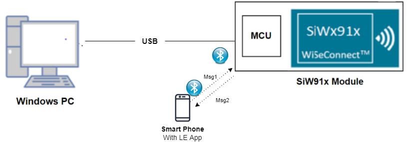
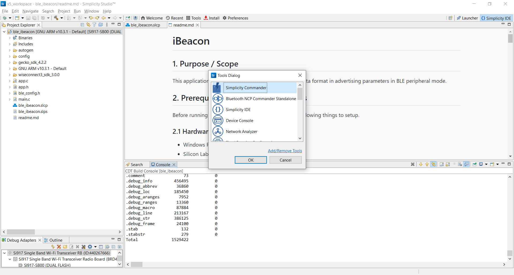
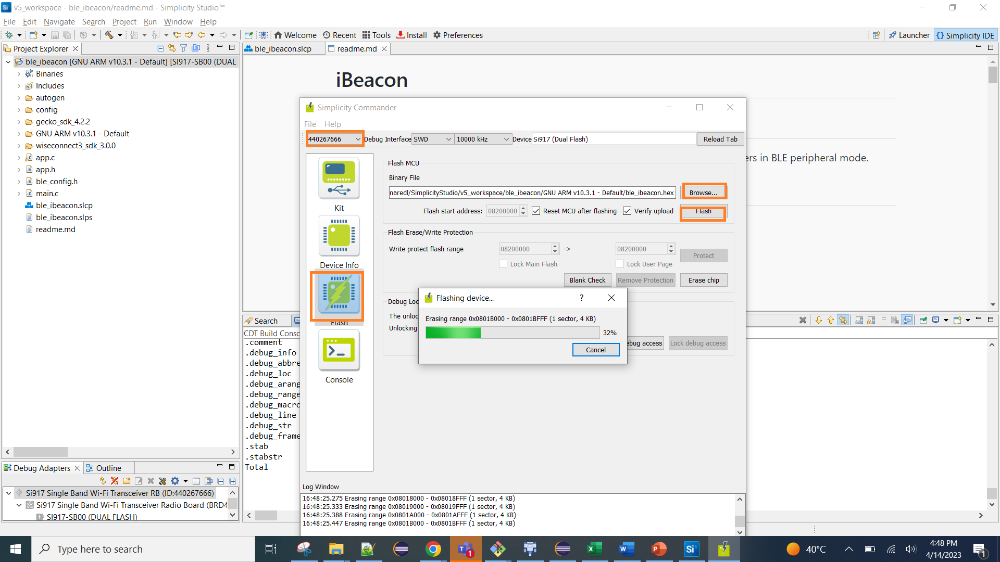
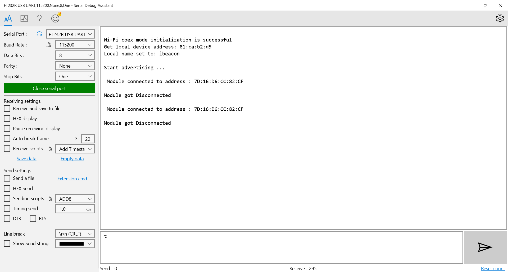

# iBeacon 

## 1. Purpose / Scope

This application demonstrates how to set the iBeacon data format in advertising parameters in  BLE peripheral mode.

## 2. Prerequisites / Setup Requirements

Before running the application, the user will need the following things to setup.

### 2.1 Hardware Requirements

- Windows PC with Host interface(UART/ SPI/ SDIO).
   - SiWx91x Wi-Fi Evaluation Kit. The SiWx91x supports multiple operating modes. See [Operating Modes]() for details.
  - **SoC Mode**: 
      - Silicon Labs [BRD4325A, BRD4325B](https://www.silabs.com/)
  - **NCP Mode**:
      - Silicon Labs [(BRD4180A, BRD4280B)](https://www.silabs.com/);
      - Host MCU Eval Kit. This example has been tested with:
        - Silicon Labs [WSTK + EFR32MG21](https://www.silabs.com/development-tools/wireless/efr32xg21-bluetooth-starter-kit)

- Smart phone with ibeacon detector application

### 2.2 Software Requirements
    
- **SoC Mode**
  - **Silicon Labs SiWx91x SoC**. Follow the [Getting Started with SiWx91x SoC](https://docs.silabs.com/) to setup the example to work with SiWx91x SoC and Simplicity Studio.
- **NCP Mode**
  - **Silicon Labs EFx32 Host**. Follow the [Getting Started with EFx32](https://docs.silabs.com/rs9116-wiseconnect/latest/wifibt-wc-getting-started-with-efx32/) to setup the example to work with EFx32 and Simplicity Studio.

### 2.3 Setup Diagram	

**SoC Mode :** 
   

  
**NCP Mode :**  
   

### 2.4 iBeacon details
**iBeacon Advertise Data Format**

	 iBeacon prefix   UUID        Major Number   Minor Number    TX Power
	 9Bytes           16bytes     2Bytes         2 Bytes         1bytes

   **iBeacon Prefix:**
   Vendor specific fixed value.
   Default iBeacon prefix values setting by application is,
   Prefix = {0x02, 0x01, 0x02, 0x1A, 0xFF, 0x4C, 0x00, 0x02, 0x15}

   **UUID:**
   User generated proximity UUID.
   Remote devices recognize which beacon they approach on the basis of UUID, major and minor numbers.
   Default UUID, Major and Minor values setting by application is,
   UUID = {0xFB , 0x0B , 0x57 , 0xA2 , 0x82 , 0x28 , 0x44 , 0xCD , 0x91 ,
   0x3A , 0x94 , 0xA1 , 0x22 , 0xBA , 0x12 , 0x06}
   major_num = {0x11, 0x22}
   minor_num = {0x33, 0x44}

   **TX Power** is used to calculate distance from iBeacon.
   Default TX power value setting by application is,
   TX Power = 0x33

	 Note:
	 If the user wants to change the prefix, UUID, Major number, Minor number and TX Power values, change the following values in rsi_ble_ibeacon.c_ file.

   For Prefix:
   `<span style="color: #005032">uint8_t</span> adv[31] = {0x02, 0x01, 0x02, 0x1A, 0xFF, 0x4C, 0x00, 0x02, 0x15}; //prefix(9bytes)`

   **For UUID:**

   uint8_t uuid[16] = {0xFB , 0x0B , 0x57 , 0xA2 , 0x82 , 0x28 , 0x44 , 0xCD , 0x91 , 0x3A , 0x94 , 0xA1 , 0x22 , 0xBA , 0x12 , 0x06};
   
- For Major Number:
   - uint8_t major_num[2] = {0x11, 0x22};
   
- For Minor Number:
   - uint8_t minor_num[2] = {0x33, 0x44};
   
- For TX Power:
   - uint8_t tx_power = 0x33;

## 3. Project Environment

### 3.1 Project Creation

#### 3.1.1 SoC Mode

1. Ensure the SiWx91x setup is connected to your PC.

- In the Simplicity Studio IDE, the SiWx91x SoC board will be detected under **Debug Adapters** pane as shown below.

   
   
- Studio should detect your board. Your board will be shown here. Click on the board detected and go to **EXAMPLE PROJECTS & DEMOS** section.  

- Filter for Bluetooth examples from the Gecko SDK added. For this, check the *Bluetooth* checkbox under **Wireless Technology** and select *BLE - iBeacon* application.

   

- Click 'Create'. The "New Project Wizard" window appears. Click 'Finish'

  

#### 3.1.2 NCP Mode

1. Ensure the EFx32 and SiWx91x setup is connected to your PC.

- In the Simplicity Studio IDE, the EFR32 board will be detected under **Debug Adapters** pane as shown below.
   
   

- Ensure the latest Gecko SDK along with the WiSeConnect 3 extension is added to Simplicity Studio.

- Go to the 'EXAMPLE PROJECT & DEMOS' tab and select *BLE - iBeacon* application.

- Click 'Create'. The "New Project Wizard" window appears. Click 'Finish'.

  
  
### 3.2 Setup for Application Prints

#### 3.2.1 SoC Mode

  You can use either of the below USB to UART converters for application prints.

1. Setup using USB to UART converter board.

   - Connect Tx (Pin-6) to P27 on WSTK
   - Connect GND (Pin 8 or 10) to GND on WSTK

   ****

2. Setup using USB to UART converter cable.

    - Connect RX (Pin 5) of TTL convertor to P27 on WSTK
    - Connect GND (Pin1) of TTL convertor to GND on WSTK
    
   ****


**Tera Term setup - for NCP and SoC modes**

1. Open the Tera Term tool.

	- For SoC mode, choose the serial port to which USB to UART converter is connected and click on **OK**. 

   ****

	- For NCP mode, choose the J-Link port and click on **OK**.
    
   ****

2. Navigate to the Setup → Serial port and update the baud rate to **115200** and click on **OK**.

  ****
 
  ****


## 4. Application Build Environment

The application can be configured to suit your requirements and development environment. Read through the following sections and make any changes needed.

### 4.1 Application Configuration Parameters

The application can be configured to suit your requirements and development environment. Read through the following sections and make any changes needed.

**4.1** Open `ble_ibeacon.c` file and update/modify following macros:

- `RSI_BLE_LOCAL_NAME` refers name of the Silicon Labs device to appear during scanning by remote devices.
```c
	 #define RSI_BLE_LOCAL_NAME                     "ibeacon"```
- Following are the event numbers for connection and Disconnection events,
```c
	 #define RSI_APP_EVENT_CONNECTED                1
	 #define RSI_APP_EVENT_DISCONNECTED             2```
- Following are the **non-configurable** macros in the application.
   - BT_GLOBAL_BUFF_LEN refers Number of bytes required by the application and the driver
```c
	 #define BT_GLOBAL_BUFF_LEN                     15000
```

**4.2** Open `ble_config.h` file and update/modify following macros,
```c
	 #define RSI_BLE_PWR_INX                        30
	 #define RSI_BLE_PWR_SAVE_OPTIONS               0
```	 
   **Opermode command parameters** 
```c
	 #define RSI_FEATURE_BIT_MAP                    FEAT_SECURITY_OPEN
	 #define RSI_TCP_IP_BYPASS                      RSI_DISABLE
	 #define RSI_TCP_IP_FEATURE_BIT_MAP             TCP_IP_FEAT_DHCPV4_CLIENT
	 #define RSI_CUSTOM_FEATURE_BIT_MAP             FEAT_CUSTOM_FEAT_EXTENTION_VALID
	 #define RSI_EXT_CUSTOM_FEATURE_BIT_MAP         EXT_FEAT_384K_MODE
```	 
**Note:**
   rsi_ble_config.h files are already set with desired configuration in respective example folders user need not change for each example.
   
## 5. Build and Test the Application

- Follow the below steps for the successful execution of the application.

### 5.1 Build the Application

- Follow the below steps for the successful execution of the application.

#### SoC Mode

- Once the project is created, click on the build icon (hammer) to build the project (or) right click on project and click on Build Project.

   
   
- Successful build output will show as below.
   
#### NCP Mode :

   
   
- Successful build output will show as below.

### 5.2 Loading the Application Image

1. Click on Tools and Simplicity Commander as shown below.

   
   
2. Load the firmware image
	- Select the board. 
	- Browse the application image (.hex) and click on Flash button.

   

### 5.3 Running the SiWx91x Application

1. After the program gets executed, Silicon Labs module would be in Advertising state.

2. Connect any serial console for prints.

3. Open iBeaconDetector app in the Smartphone and do Scan.

4. In the App, Silicon Labs module device would appear with the name configured in the macro **RSI\_BLE\_LOCAL\_NAME** (Ex: "ibeacon") or sometimes observed as "SimpleBLEPeripheral".

5. After successful scan, user can see the Silicon Labs device advertised data i.e UUID, Maximum Number, Minimum Number and TX Power in iBeaconDetector application.  

6. Refer the below images for console prints

## 7. Observing the output prints on serial terminal

   
