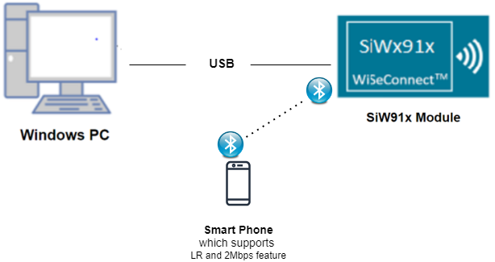
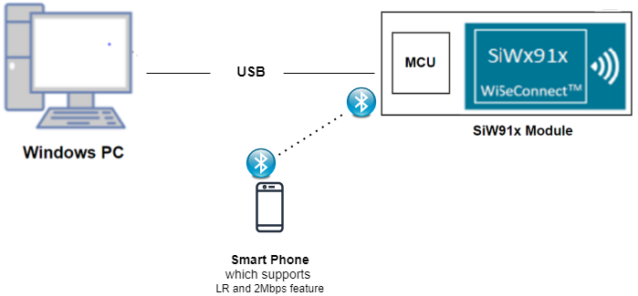
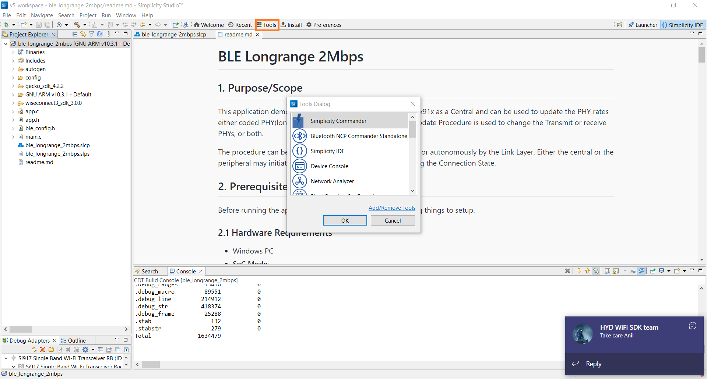
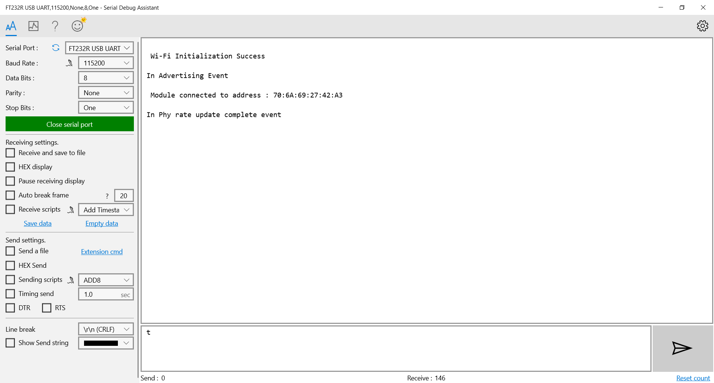

# BLE Longrange 2Mbps

## 1. Purpose/Scope

This application demonstrates how to configure/connects SiWx91x as a Central and can be used to update the PHY rates either coded PHY(long range) or 2Mbps PHY rates. The PHY update Procedure is used to change the Transmit or receive PHYs, or both.

The procedure can be initiated either on a request by the host or autonomously by the Link Layer. Either the central or the peripheral may initiate this procedure at any time after entering the Connection State.

## 2. Prerequisites/Setup Requirements

Before running the application, the user will need the following things to setup.

### 2.1 Hardware Requirements

- Windows PC
- **SoC Mode**: 
   - Silicon Labs [BRD4325A, BRD4325B](https://www.silabs.com/)
- **NCP Mode**:
   - Silicon Labs [(BRD4180A, BRD4280B)](https://www.silabs.com/) **AND**
   - Host MCU Eval Kit. This example has been tested with:
      - Silicon Labs [WSTK + EFR32MG21](https://www.silabs.com/development-tools/wireless/efr32xg21-bluetooth-starter-kit)

### 2.2 Software Requirements

- Simplicity Studio IDE 
	- Download the latest [Simplicity Studio IDE](https://www.silabs.com/developers/simplicity-studio)
	- Follow the [Simplicity Studio user guide](https://docs.silabs.com/simplicity-studio-5-users-guide/1.1.0/ss-5-users-guide-getting-started/install-ss-5-and-software#install-ssv5) to install Simplicity Studio IDE

- Download and install the Silicon Labs [EFR Connect App](https://www.silabs.com/developers/efr-connect-mobile-app) in the android smart phones for testing BLE applications. Users can also use their choice of BLE apps available in Android/iOS smart phones.

### 2.3 Setup Diagram:

#### SoC Mode : 
   

  
#### NCP Mode : 



**NOTE**: 
- The Host MCU platform (EFR32MG21) and the SiWx91x interact with each other through the SPI interface. 

## 3 Project Environment

- Ensure the SiWx91x loaded with the latest firmware following the [Getting started with a PC](https://docs.silabs.com/rs9116/latest/wiseconnect-getting-started)

### 3.1 Creating the Project

#### 3.1.1 SoC Mode

1. Ensure the SiWx91x setup is connected to your PC.

- In the Simplicity Studio IDE, the SiWx91x SoC board will be detected under **Debug Adapters** pane as shown below.

   
   
- Studio should detect your board. Your board will be shown here. Click on the board detected and go to **EXAMPLE PROJECTS & DEMOS** section.  

- Filter for Bluetooth examples from the Gecko SDK added. For this, check the *Bluetooth* checkbox under **Wireless Technology** and select *BLE - Long Range* application.

   

- Click 'Create'. The "New Project Wizard" window appears. Click 'Finish'

  

#### 3.1.2 NCP Mode

1. Ensure the EFx32 and SiWx91x set up is connected to your PC.

- In the Simplicity Studio IDE, the EFR32 board will be detected under **Debug Adapters** pane as shown below.
   
   

- Ensure the latest Gecko SDK along with the WiSeConnect 3 extension is added to Simplicity Studio.

- Go to the 'EXAMPLE PROJECT & DEMOS' tab and select *BLE - Long Range* application.

- Click 'Create'. The "New Project Wizard" window appears. Click 'Finish'.

  


### 3.2 Setup for Application Prints

#### 3.2.1 SoC mode

  You can use either of the below USB to UART converters for application prints.

1. Setup using USB to UART converter board.

	 - Connect Tx (Pin-6) to P27 on WSTK
    - Connect GND (Pin 8 or 10) to GND on WSTK

   ****

2. Setup using USB to UART converter cable.

    - Connect RX (Pin 5) of TTL convertor to P27 on WSTK
    - Connect GND (Pin1) of TTL convertor to GND on WSTK
    
   ****


**Tera Term setup - for NCP and SoC modes**

1. Open the Tera Term tool.

	- For SoC mode, choose the serial port to which USB to UART converter is connected and click on **OK**. 

   ****

	- For NCP mode, choose the J-Link port and click on **OK**.
    
   ****

2. Navigate to the Setup → Serial port and update the baud rate to **115200** and click on **OK**.
   
   ****

   ****


## 4 Application Build Environment

The application can be configured to suit your requirements and development environment. 

### 4.1 Configure the application

Read through the following sections and make any changes needed.

**4.1** Open `app.c` file and update/modify following macros,

**4.1.1** User must update the below parameters

- `RSI_DEVICE_DATA_RATE` refers the PHY data rate of the Silicon Labs module to be selected.

- If user configures, **LONG_RANGE**, Silicon Labs module will update PHY data rates to coded PHY data rate. By default it is configured to 500kbps PHY data rate. 

- If user configures, **TWO_MBPS**, Silicon Labs module will update 2Mbps PHY data rates. 

```c
    #define RSI_DEVICE_DATA_RATE                LONG_RANGE
```

- `RSI_BLE_DEV_ADDR_TYPE` refers address type of the remote device to connect.

```c
	 #define RSI_BLE_DEV_ADDR_TYPE                         LE_PUBLIC_ADDRESS
``` 
- Based on the address of the advertising device, Valid configurations are

   - LE_RANDOM_ADDRESS
   - LE_PUBLIC_ADDRESS

   **Note:** Depends on the remote device, address type will be changed. 

- `RSI_BLE_DEV_ADDR` refers address of the remote device to connect.

```c
	 #define RSI_BLE_DEV_ADDR                          "00:23:A7:80:70:B9"
```

- `RSI_REMOTE_DEVICE_NAME` refers the name of remote device to which Silicon Labs device has to connect

```c
	 #define RSI_REMOTE_DEVICE_NAME                              "SILABS"
```

   **Note:**
   Silicon Labs module can connect to remote device by referring either RSI_BLE_DEV_ADDR or RSI_REMOTE_DEVICE_NAME of the remote device. 

**Power save configuration**

- By default, The Application is configured without power save.

```c	 
	 #define ENABLE_POWER_SAVE 0
```

- If user wants to run the application in power save, modify the below configuration. 
```c	 
	 #define ENABLE_POWER_SAVE 1
```

**4.1.2** The desired parameters are provided below. User can also modify the parameters as per their needs and requirements
   

**4.1.3** Open `ble_config.h` file and update/modify following macros,
```c
	 #define RSI_BLE_PWR_INX                                   30
	 #define RSI_BLE_PWR_SAVE_OPTIONS                          0 
```	 

 **Opermode command parameters**

```c
	 #define RSI_FEATURE_BIT_MAP                                 FEAT_SECURITY_OPEN
	 #define RSI_TCP_IP_BYPASS                                   RSI_DISABLE
	 #define RSI_TCP_IP_FEATURE_BIT_MAP                          TCP_IP_FEAT_DHCPV4_CLIENT
	 #define RSI_CUSTOM_FEATURE_BIT_MAP                          FEAT_CUSTOM_FEAT_EXTENTION_VALID
	 #define RSI_EXT_CUSTOM_FEATURE_BIT_MAP                      EXT_FEAT_384K_MODE
```

**Note:**
   `ble_config.h` files are already set with desired configuration in 
   respective example folders user need not change for each example. 


### 4.2 Build the Application

- Follow the below steps for the successful execution of the application.

#### Build Project - SoC Mode

- Once the project is created, click on the build icon (hammer) to build the project (or) right click on project and click on Build Project.

   
   
- Successful build output will show as below.
   
#### Build Project - NCP Mode :

   
   
- Successful build output will show as below.

### 4.3 Run and Test the Application

- Once the build was successfull, load the application image.

#### 4.3.1 Load the Application Image

1. Click on Tools and Simplicity Commander as shown below.

   
   
2. Load the firmware image
	- Select the board. 
	- Browse the application image (.hex) and click on Flash button.

   

### 4.3.2 Steps to be followed to verify BLE Long Range Application

1. Configure the remote BLE device in advertising mode. For remote mobile if connecting using name ensure that the device is named same as the value mentioned in RSI_REMOTE_DEVICE_NAME macro also see to it that Complete local name record is added to advertising data and Scan response data and connectable is ticked in options.

   **Note:** Refer the [Creating New Advertisement Sets](https://docs.silabs.com/bluetooth/5.0/miscellaneous/mobile/efr-connect-mobile-app) for configuring the EFR connect mobile APP as advertiser.

3. After the program gets executed, Silicon Labs device tries to connect with the remote device specified in **RSI\_BLE\_DEV\_ADDR** **or RSI\_REMOTE\_DEVICE\_NAME** macro.

4. Clicks on "YES AND OPEN" button and Observe that the connection is established between the desired device and Silicon Labs device.
   
5. After connection, Silicon Labs device will read PHY rate of the remote device and set PHY rate of the remote device.

6. Observe PHY update complete event after setting PHY rate.

7. When Silicon Labs module is configured as **LONG_RANGE** PHY data rate, the Slicon Labs module and remote device updates its PHY data rate to 500kbps and prints in teraterm looks as shown below.   

8. When Silicon Labs module is configured as **TWO_MBPS** PHY data rate, the Slicon Labs module and remote device updates its PHY data rate to 1mbps and prints in teraterm looks as shown below.   

- Once the build was successful, right click on project and click on Debug As->Silicon Labs ARM Program as shown in below image.

### 4.4 Application Output



   
      